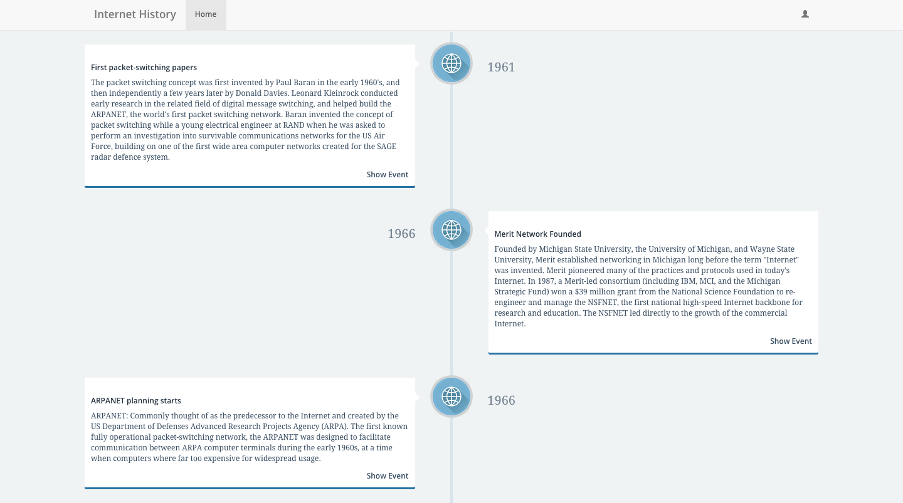

# final-project

# final-project-front

In my project I used HTML/CSS and AngularJS on the front end with Ruby on Rails  and PostgreSQL on my back end.

When approaching this project I wanted a chance to practice AngularJS further and knew it would be a good language for the way I wanted to display my data. I started by writing out user stories and drawing wireframes to decide what information I wanted to get and how I wanted to display it. From there I was able to confirm that the languages I was using were a good choice for my website.
After planning what information I wanted to display I built out my wireframes and started installing the basic files I would need for Angular. Another reason I wanted to use Angular was I like how it keeps concerns separated.
From there I moved back and forth between the front and back end, adding data and routes and testing as I went.

My project needs angular, angular-route, simpleStorage, jQuery and bootstrap. You can install each of these by typing bower install <name> into the terminal. You can then link to the files in the bottom of the body in your HTML page.

User stories -
Most of my website is based upon visitors and not users. Visitors do not have to create an account to see the timeline and show further details of specific events.
I did create an admin user so that there I could have create, update and delete actions on my events but use simpleStorage so that you must be an admin to CRUD.
User stories link - https://github.com/caraclarke/final-project-front/blob/master/user_stories.txt

Wireframes link -
https://github.com/caraclarke/final-project-front/blob/master/project4-wireframe.pdf

As I continue to work on this project I want to use authentication more. I have details I want to add in such as hiding and showing certain buttons, udpate and delete for users and create for events.
